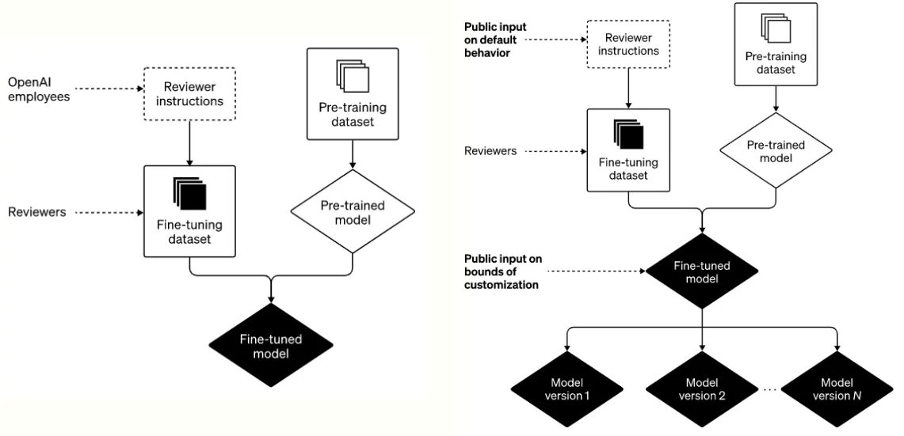

*Written by [Emiliano Reynares](https://www.linkedin.com/in/ereynrs/)*

In a recent [post](https://openai.com/blog/how-should-ai-systems-behave/), OpenAI states they are monitoring the controversies — aka offensive and biased outcomes — raised by their more recent and worldwide infamous model. So they decided to share the training process, its roadmap, and the approach strived to address raising ethical issues. The key points are distilled below.

## The current training process

OpenAI trains ChatGPT in two phases.

The system learns grammar and real-world facts in the first one. As a result, it can predict the next word in a sentence by getting some reasoning capabilities.

OpenAI and human reviewers fine-tuned the system in a second phase. The ***reviewers review and rate system outputs according to the guidelines outlined by OpenAI*** around a few categories.

It sounds simple and effective. But it does not. Because ***right from the beginning, the users found outputs that could be deemed politically biased, offensive, or objectionable***.

## The improved training process

OpenAI claims to be willing to address those shortcomings since the system outcome biases are bugs, not features.

Beyond the evident duty of improving the guidelines, there is a plan to share aggregated demographic information about the reviewers, ask for public feedback, and partner with external organizations to conduct audits.

On the technical side, they also want to better understand and ***increase the control of the fine-tuning process by including rule-based awards and Constitutional AI advances***.

## As many ChatGPT tastes as users
OpenAI claims to be on a mission ***to ensure highly autonomous systems that outperform humans at most economically valuable work benefits all of humanity***.

The intention is to avoid building a single monolithic AI system to rule them all through a never seen so far concentration of power since individual people should be able to benefit from it.

Then, an upgrade to ChatGPT aimed to ***allow users to customize ChatGPT behavior is on the roadmap, but up to the limits defined by society***.

OpenAI quickly puts itself in the spotlight by stating that technology companies must be accountable for producing policies that stand up to scrutiny. However, developing policies is the aim of governments and international organizations, particularly when we face a development with the power to change each aspect of our lives.

It’s evident that ***how to enforce those bounds is all a technical endeavor, but empowering the community to discuss and agree on those bounds is the real challenge***.

##### Visit my [LinkedIn Profile](https://www.linkedin.com/in/ereynrs/)
