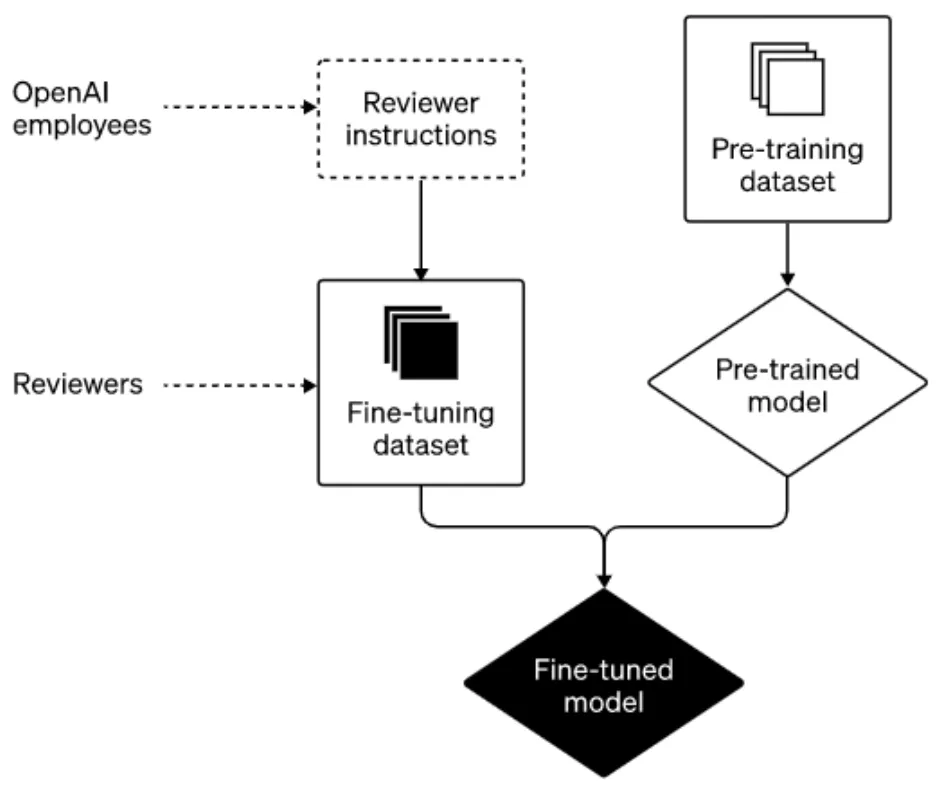

*Written by [Emiliano Reynares](https://www.linkedin.com/in/ereynrs/)*

Let’s be honest. You read and hear about ChatGPT all over the place. But there are at least 5 ChatGPT-related questions you avoid asking because you still want to look tech-savvy. No need to ask anymore, because 👇 are the answers.

## Q1. What’s ChatGPT?
ChatGPT is a transformer-based language model developed by OpenAI. It is based on the GPT (Generative Pre-training Transformer) architecture and is fine-tuned on conversational data to generate human-like responses.

It’s designed for NLP, dialogue generation, question answering, and summarization.

[This](https://openai.com/blog/chatgpt/) blog post announced its roll-out on Nov 22.

### Q2. What’s a language model?
A language model is typically based on neural networks. They can learn the patterns and structure of language from text data and generate new text based on that understanding.

A Large Language Model (LLM) is designed to process and understand language AT A LARGE SCALE. Plus ChatGPT, some of the most well-known LLMs include its predecessor (GPT-3) and Google’s BERT.

The first half of next 8 mins video gives you the intuition on LLMs.

<iframe width="560" height="315" src="https://www.youtube.com/embed/lnA9DMvHtfI?si=8TJF2uYi1icQvIzc" title="YouTube video player" frameborder="0" allow="accelerometer; autoplay; clipboard-write; encrypted-media; gyroscope; picture-in-picture; web-share" allowfullscreen></iframe>

### Q3. What’s a transformer-based language model?
The transformer-based neural network architecture is a deep learning model introduced by researchers at Google in 2017 as an alternative to Recurrent Neural Network (RNN) models.

Unlike RNNs, the transformer-based model processes all the input data at once, enabling the processing of longer sequences of text by parallelizing the computation.

The next video explains the basic notions of transformers.

<iframe width="560" height="315" src="https://www.youtube.com/embed/ZXiruGOCn9s?si=vQkkhl7jdg13bIWn" title="YouTube video player" frameborder="0" allow="accelerometer; autoplay; clipboard-write; encrypted-media; gyroscope; picture-in-picture; web-share" allowfullscreen></iframe>

### Q4. What’s the GPT architecture?
The GPT architecture is a stack of transformer layers. It’s pre-trained on massive amounts of text to learn to predict the next word in a sentence. GPT can be further fine-tuned for a specific task by training the model on a smaller amount of task-specific data.

Below you see a sketch of the training process.

Bonus point: in [this blog post](https://openai.com/blog/how-should-ai-systems-behave/), OpenAI details the training process, and how they plan to improve it. I’ve also written [a post](https://medium.com/@ereynrs/how-openai-plans-to-improve-chatgpt-behavior-9f562a74b311) highlighting the takeaways.

### Q5. How can I start using it?
Just head to the OpenAI website and try out their [demo](https://chat.openai.com/chat).

##### Visit my [LinkedIn Profile](https://www.linkedin.com/in/ereynrs/)
